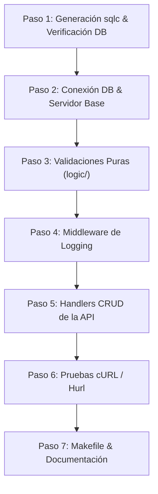

# Plan de Implementación: TP Especial - TP3 (API REST con sqlc y net/http)

## Descripción del Objetivo

El objetivo es implementar la etapa del **Trabajo de Cursada (TP Especial)** correspondiente al **TP3**, según lo especificado en [tp3.md](file:///home/facha/Documents/FACU/WEB/web-sistemas/teoria/tp3.md) y las filminas de [07-logic.md](file:///home/facha/Documents/FACU/WEB/web-sistemas/teoria/07-logic.md).

Actualmente en [tpespecial/tp3](file:///home/facha/Documents/FACU/WEB/web-sistemas/tpespecial/tp3) disponemos de:
- El esquema PostgreSQL con 3 tablas: `categoria`, `producto` (con FK a `categoria`) y `cliente` en [schema.sql](file:///home/facha/Documents/FACU/WEB/web-sistemas/tpespecial/tp3/db/schema/schema.sql).
- Las consultas SQL generadoras de [querys.sql](file:///home/facha/Documents/FACU/WEB/web-sistemas/tpespecial/tp3/db/queries/querys.sql).
- El entorno Docker ([docker-compose.yml](file:///home/facha/Documents/FACU/WEB/web-sistemas/tpespecial/tp3/.devcontainer/docker-compose.yml)) y Makefile para correr tests de base de datos.
- Un [main.go](file:///home/facha/Documents/FACU/WEB/web-sistemas/tpespecial/tp3/main.go) inicial que solo levanta un servidor de archivos estáticos.

Se construirá una **API REST pura** conectada a la base de datos a través del repositorio generado por `sqlc`, cumpliendo con:
1. Conexión a PostgreSQL en `main.go`.
2. Lógica pura de validación de negocio desacoplada de HTTP en `logic/`.
3. Handlers CRUD completos con la biblioteca estándar `net/http` y `encoding/json`.
4. Middleware de logging canónico visto en la cátedra.
5. Suite de pruebas reproducibles con script cURL / Hurl.
6. Actualización de `Makefile`, `README.md` y `documentacion.md`.

---

## User Review Required

> [!IMPORTANT]
> **Metodología Pedagógica (Tutoría Paso a Paso / Cero Spoilers)**:
> Siguiendo las reglas de [AGENTS.md](file:///home/facha/Documents/FACU/WEB/web-sistemas/AGENTS.md), este plan se ejecutará en **fases incrementales y guiadas**. En cada paso, el tutor explicará el concepto con ejemplos por analogía (usando otra entidad distinta, como `Libro` o `Tarea`), para que tú mismo escribas o valides el código de tus entidades sin "olor a IA" ni código regalado.

> [!NOTE]
> **Cero Sobreingeniería**:
> No se utilizarán routers externos (ni Gin, ni Echo, ni Chi) ni arquitecturas con capas infladas. Todo el enrutamiento y serialización se realiza con `net/http`, `encoding/json` y los métodos generados por `sqlc` (`*db.Queries`).

---

## Open Questions

> [!IMPORTANT]
> 1. **Alcance de las entidades expuestas**:
>    En la base de datos existen tres entidades: `categoria`, `producto` y `cliente`. Dado que `producto` tiene una relación foránea obligatoria con `categoria`, el plan propone implementar el CRUD completo de `/productos` y `/categorias` (y opcionalmente `/clientes`). ¿Deseas exponer las tres entidades o concentrarte en `productos` y `categorias`?
>
> 2. **Formato preferido para las pruebas de API**:
>    La cátedra acepta scripts con `curl` (`requests.sh`) o archivos `requests.hurl`. ¿Tienes preferencia por script Bash con `curl`, archivo `requests.hurl`, o ambos?

---

## Metodología y Fases de Trabajo (Paso a Paso)



---

## Proposed Changes

### Componente 1: Base de Datos y Repositorio sqlc
Verificar y compilar los archivos generados por `sqlc` en [tpespecial/tp3/db/sqlc](file:///home/facha/Documents/FACU/WEB/web-sistemas/tpespecial/tp3/db/sqlc).

#### [MODIFY] [tpespecial/tp3/Makefile](file:///home/facha/Documents/FACU/WEB/web-sistemas/tpespecial/tp3/Makefile)
- Agregar un target `run` para levantar el contenedor de Postgres y correr el servidor Go mapeando el puerto 8080.
- Agregar target `api-test` para ejecutar las pruebas contra el servidor corriendo.

---

### Componente 2: Capa de Lógica Pura (`logic/`)
Implementar reglas de negocio desacopladas de HTTP y de la base de datos (funciones puras), siguiendo las filminas de `teoria/07-logic.md`.

#### [NEW] [tpespecial/tp3/logic/producto.go](file:///home/facha/Documents/FACU/WEB/web-sistemas/tpespecial/tp3/logic/producto.go)
- Validación de datos de entrada para productos:
  - Nombre no vacío.
  - Precio mayor a 0.
  - Stock no negativo (>= 0).
  - Categoría asociada válida (ID > 0).

#### [NEW] [tpespecial/tp3/logic/categoria.go](file:///home/facha/Documents/FACU/WEB/web-sistemas/tpespecial/tp3/logic/categoria.go)
- Validación de datos para categoría:
  - Nombre no vacío.

---

### Componente 3: Servidor HTTP y Enrutador (`net/http`)
Reemplazar el servidor de archivos estáticos de [tpespecial/tp3/main.go](file:///home/facha/Documents/FACU/WEB/web-sistemas/tpespecial/tp3/main.go) con el servidor REST.

#### [MODIFY] [tpespecial/tp3/main.go](file:///home/facha/Documents/FACU/WEB/web-sistemas/tpespecial/tp3/main.go)
- Conexión a la base de datos PostgreSQL mediante driver `_ "github.com/jackc/pgx/v5/stdlib"` y `sql.Open("pgx", dsn)`.
- Instanciación de `queries := db.New(conn)`.
- Definición de una estructura `Server` simple:
  ```go
  type Server struct {
      queries *db.Queries
  }
  ```
- Implementación del `loggingMiddleware(next http.Handler) http.Handler` visto en `notas.md`.
- Enrutadores unificados para `/productos` y `/categorias`:
  - `GET /productos`: Listar productos (`queries.ListarProductos`). Devuelve JSON 200 OK.
  - `POST /productos`: Crear producto. Valida con `logic.ValidateProducto`, persiste con `queries.CrearProducto` y devuelve 201 Created.
  - `GET /productos/{id}`: Obtener por ID (`queries.GetProducto`). Devuelve 200 OK o 404 Not Found si `sql.ErrNoRows`.
  - `PUT /productos/{id}`: Actualizar por ID (`queries.ActualizarProducto`). Devuelve 200 OK o 404 Not Found.
  - `DELETE /productos/{id}`: Eliminar por ID (`queries.BorrarProducto`). Devuelve 204 No Content o 404 Not Found.
- Mantener la ruta opcional `/` para servir archivos de `./static` o redirigir según necesidad.

---

### Componente 4: Pruebas de la API
Creación de las pruebas automatizadas requeridas por la cátedra para verificar los endpoints y sus códigos de respuesta HTTP.

#### [NEW] [tpespecial/tp3/requests.sh](file:///home/facha/Documents/FACU/WEB/web-sistemas/tpespecial/tp3/requests.sh)
Script bash reproducible con `curl` que realiza:
1. `POST /categorias` -> 201 Created.
2. `POST /productos` -> 201 Created.
3. `GET /productos` -> 200 OK (verifica inclusión).
4. `GET /productos/{id}` -> 200 OK.
5. `PUT /productos/{id}` -> 200 OK (verifica actualización).
6. Casos de error:
   - `POST /productos` con datos vacíos -> 400 Bad Request.
   - `GET /productos/99999` -> 404 Not Found.
   - Método no soportado (`PATCH /productos`) -> 405 Method Not Allowed.
7. `DELETE /productos/{id}` -> 204 No Content.
8. `GET /productos/{id}` tras borrado -> 404 Not Found.

#### [NEW] [tpespecial/tp3/requests.hurl](file:///home/facha/Documents/FACU/WEB/web-sistemas/tpespecial/tp3/requests.hurl) (opcional/complementario)
Archivo Hurl con aserciones `jsonpath` y códigos HTTP esperados.

---

### Componente 5: Documentación y Entrega

#### [MODIFY] [tpespecial/tp3/README.md](file:///home/facha/Documents/FACU/WEB/web-sistemas/tpespecial/tp3/README.md)
- Actualizar el título y requisitos para reflejar el TP3 (API REST con persistencia).
- Incluir instrucciones claras:
  - Cómo iniciar la base de datos y el servidor con Docker / Makefile.
  - Cómo ejecutar las pruebas con `requests.sh` o `requests.hurl`.

#### [MODIFY] [tpespecial/tp3/documentacion.md](file:///home/facha/Documents/FACU/WEB/web-sistemas/tpespecial/tp3/documentacion.md)
- Explicar las decisiones de diseño:
  - Uso de funciones puras en `logic/`.
  - Estructura de handlers unificados con `net/http` estándar.
  - Inyección del repositorio de `sqlc`.
  - Middleware de logging.

---

## Verification Plan

### Automated Tests
1. **Tests unitarios e integración de base de datos**:
   ```bash
   cd tpespecial/tp3 && make test
   ```
2. **Generación de código sqlc**:
   ```bash
   cd tpespecial/tp3 && make sqlc
   ```
3. **Pruebas de la API REST**:
   Levantar el servidor y ejecutar:
   ```bash
   chmod +x requests.sh
   ./requests.sh
   ```
   o con hurl:
   ```bash
   hurl --test requests.hurl
   ```

### Manual Verification
1. Probar manualmente llamadas cURL desde la terminal para verificar las cabeceras `Content-Type: application/json` y los códigos HTTP 200, 201, 204, 400, 404, 405.
2. Observar en los logs del servidor cómo el `loggingMiddleware` imprime el método, la URL y la dirección IP de cada petición.
